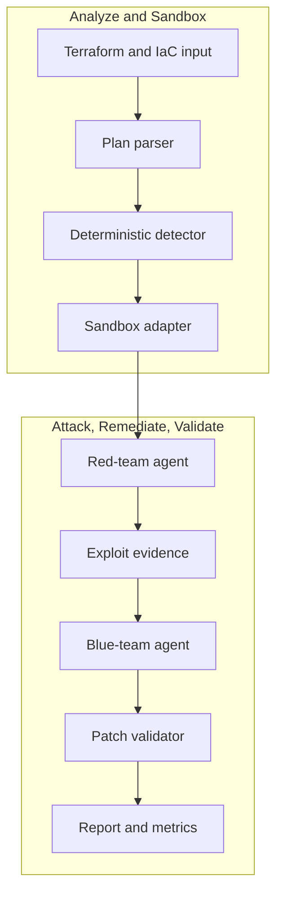

# nullstate

Autonomous purple-teaming CLI for infrastructure-as-code sandboxes.


`nullstate` runs a tight local security validation loop:

1. Read Terraform/IaC input.
2. Detect exploitable misconfigurations.
3. Infer the scenario and route it to a sandbox backend.
4. Let a red-team agent reason about the attack.
5. Execute a constrained generated attack script against the local target.
6. Let a blue-team agent explain and remediate.
7. Validate the attack is blocked.
8. Write case-study-ready evidence and metrics.

The hackathon V1 has offline deterministic demos for Azure, AWS, Kubernetes, Docker Compose, on-prem baselines, and generic plan review. Live sandbox execution is being added incrementally, starting with LocalStack Azure.

## Why this exists

Static IaC scanners can identify risky configuration, but they do not always prove whether an attacker can use it or whether a remediation blocks the path. `nullstate` turns IaC security review into a repeatable purple-team loop with local-first sandboxes and sanitized evidence artifacts.

## Architecture



See [Architecture](docs/architecture.md).

## Security model

V1 does not target real cloud environments by default. Sandboxes are explicit, run artifacts are local, and remediation happens in a copied run workspace rather than mutating the original Terraform directory. The red tool runner is constrained to generated `attack.py` scripts inside the run directory and records command, stdout, stderr, return code, target URL, and timestamps in `events.jsonl`. See [Security Model](docs/security-model.md) and [Threat Model](docs/threat-model.md).

## Installation

Current source install:

```powershell
git clone https://github.com/Ker102/nullstate-cli.git
cd nullstate-cli
python -m pip install -e .
```

This installs the package dependencies and the `nullstate` console command declared in `pyproject.toml`.

If `nullstate` is not recognized after install, your Python Scripts directory is not on `PATH`. You can still run the same CLI through Python:

```powershell
python -m nullstate doctor --offline
```

To see where Python installed console scripts:

```powershell
python -c "import sysconfig; print(sysconfig.get_path('scripts'))"
```

After the first prerelease tag exists, install directly from GitHub:

```powershell
python -m pip install "git+https://github.com/Ker102/nullstate-cli.git@v0.1.0-alpha.1"
```

## Quickstart

```powershell
nullstate doctor --offline
nullstate status
nullstate init-demo azure-public-blob --output examples/azure-public-blob
nullstate run examples/azure-public-blob --offline
nullstate report
```

Run another offline scenario:

```powershell
nullstate run examples/aws-public-s3 --offline
nullstate run examples/k8s-privileged-pod --offline
```

Sandbox discovery:

```powershell
nullstate sandbox list
nullstate sandbox status localstack-azure
nullstate sandbox up localstack-azure --dry-run
nullstate scenarios list
```

`status`, `init-demo`, `sandbox`, and `run` print a short `Next` table with the most likely follow-up commands. `run` defaults to `--scenario auto` and `--target auto`; the CLI infers the scenario from the IaC shape and picks the matching sandbox backend. Pass `--scenario` or `--target` only when recording a specific demo path or testing an adapter.

Open the latest report:

```powershell
nullstate report
```

If you keep runs under a named folder, point report lookup at the parent:

```powershell
nullstate report --runs-dir runs/live-aws-model
nullstate report 20260509-200601 --runs-dir runs
```

## Live LocalStack Azure Path

Use this after Docker, LocalStack Azure access, and the AzureRM provider are configured:

```powershell
nullstate sandbox up localstack-azure
nullstate sandbox status localstack-azure
nullstate doctor
nullstate run examples/azure-public-blob
nullstate report
```

The demo Terraform provider includes:

```hcl
metadata_host = "localhost.localstack.cloud:4566"
```

That keeps Terraform pointed at the LocalStack Azure emulator instead of real Azure.

Keep `LOCALSTACK_AUTH_TOKEN` in the shell, `.env.local`, or `.env`. `nullstate sandbox up` auto-discovers `.env.local` first and `.env` second, and `--env-file` remains available for a custom path.

Docker Compose alternative:

```powershell
$env:LOCALSTACK_AUTH_TOKEN = "<token>"
docker compose -f docker-compose.localstack-azure.yml up
```

Or create a local `.env` file next to the compose file:

```env
LOCALSTACK_AUTH_TOKEN=your-token-here
```

`.env` and `.env.local` are ignored by Git. Do not commit the token.

## Model endpoint

`nullstate` talks to OpenAI-compatible model servers. The simplest setup is one endpoint serving both roles:

```powershell
$env:NULLSTATE_LLM_BASE_URL = "http://<mi300x-host>:8000"
$env:NULLSTATE_LLM_API_KEY = "<optional-token>"
nullstate run examples/azure-public-blob --blue-model gemma-4-31b-it --red-model qwen3-coder-next
```

For two vLLM/SGLang containers or two SSH tunnels, set role-specific endpoints:

```powershell
$env:NULLSTATE_RED_LLM_BASE_URL = "http://127.0.0.1:8001"
$env:NULLSTATE_BLUE_LLM_BASE_URL = "http://127.0.0.1:8002"
$env:NULLSTATE_RED_LLM_API_KEY = "<optional-red-token>"
$env:NULLSTATE_BLUE_LLM_API_KEY = "<optional-blue-token>"
nullstate run examples/azure-public-blob --red-model nullstate-red --blue-model nullstate-blue
```

The CLI also accepts `--red-base-url` and `--blue-base-url` for one-off runs. Role-specific settings fall back to `NULLSTATE_LLM_BASE_URL` and `NULLSTATE_LLM_API_KEY` when they are not set.

Users do not need to write prompts. `nullstate` sends internal red-team and blue-team agent instructions plus scenario evidence. If an endpoint is missing for a role, that role falls back to a deterministic mock response, so local and LocalStack demos can still run without a model. Use `--offline` to skip Terraform/cloud runtime calls and use static IaC parsing. If a shared or role-specific model endpoint is configured, `--offline` still uses that model endpoint; add `--mock-agents` only when you want deterministic no-model agent responses.

## Sandbox backends

| Backend | Mode | IaC target | Status |
|---|---|---|---|
| `localstack-azure` | executable | Terraform AzureRM | v1 demo target |
| `localstack-aws` | executable | Terraform AWS | adapter scaffolded |
| `kind-kubernetes` | executable | Kubernetes YAML, Helm, Kustomize | adapter scaffolded |
| `docker-compose` | digital twin | Docker Compose and app stacks | adapter scaffolded |
| `microvm-onprem` | digital twin | Ansible, Linux hardening, libvirt/Proxmox-style Terraform | design-ready fallback |
| `plan-only` | plan-only | any exported plan/parser | available |

## Scenarios

| Scenario | Backend | Status |
|---|---|---|
| `azure-public-blob` | `localstack-azure` | offline demo available; live LocalStack pending |
| `aws-public-s3` | `localstack-aws` | offline demo available; live LocalStack AWS pending |
| `k8s-privileged-pod` | `kind-kubernetes` | offline demo available; live kind pending |
| `compose-exposed-admin` | `docker-compose` | offline demo available; live Docker probe pending |
| `onprem-ssh-password` | `microvm-onprem` | offline demo available; microVM digital twin pending |
| `generic-plan-review` | `plan-only` | available |

## Artifacts

Each run writes:

- `runs/<run-id>/events.jsonl`
- `runs/<run-id>/findings.json`
- `runs/<run-id>/metrics.json`
- `runs/<run-id>/vllm-metrics-before.prom` when `/metrics` is reachable
- `runs/<run-id>/vllm-metrics-after.prom` when `/metrics` is reachable
- `runs/<run-id>/vllm-metrics-red-before.prom` and role-specific variants when red/blue endpoints differ
- `runs/<run-id>/attack.py`
- `runs/<run-id>/remediation.patch`
- `runs/<run-id>/report.md`

`events.jsonl` includes `red-tool` entries for the allowlisted attack command before and after remediation.

## Documentation

- [Case study](docs/case-study.md)
- [Architecture](docs/architecture.md)
- [Security model](docs/security-model.md)
- [Threat model](docs/threat-model.md)
- [CI/CD](docs/ci-cd.md)
- [Runbook](docs/runbook.md)
- [Model serving runbook](docs/model-serving.md)
- [AMD compute strategy](docs/compute-strategy.md)
- [Failure modes](docs/failure-modes.md)
- [Cost report](docs/cost-report.md)

## Release model

The `Media` prerelease is only used to host README assets. Product releases should use version tags:

| Tag | Purpose |
|---|---|
| `v0.1.0-alpha.1` | First hackathon prerelease with offline demos and polished docs |
| `v0.1.0-beta.1` | Live LocalStack Azure validation path working |
| `v0.1.0` | Final hackathon release candidate with demo video, case study, and metrics evidence |

The GitHub release title can match the tag or use a readable title such as `nullstate v0.1.0-alpha.1`.

## Status

Working now: offline deterministic demos for all listed scenarios, constrained red attack command execution, deterministic remediation, sandbox registry, report artifacts, metrics artifacts, branded CLI output, and DevSecOps repo structure.

Experimental: live LocalStack Azure execution and non-Azure live sandbox adapters.
