# nullstate

Autonomous purple-teaming CLI for infrastructure-as-code sandboxes.

`nullstate` runs a tight local security validation loop:

1. Read Terraform/IaC input.
2. Detect exploitable misconfigurations.
3. Route the scenario to a sandbox backend.
4. Let a red-team agent attempt the attack.
5. Let a blue-team agent explain and remediate.
6. Validate the attack is blocked.
7. Write case-study-ready evidence and metrics.

The hackathon V1 has one fully working scenario: Terraform Azure public Blob exposure. The backend model is broader: LocalStack Azure, LocalStack AWS, kind Kubernetes, Docker Compose digital twins, microVM/on-prem digital twins, and plan-only analysis.

## Why this exists

Static IaC scanners can identify risky configuration, but they do not always prove whether an attacker can use it or whether a remediation blocks the path. `nullstate` turns IaC security review into a repeatable purple-team loop with local-first sandboxes and sanitized evidence artifacts.

## Architecture

```mermaid
flowchart LR
    IaC[Terraform and IaC input] --> Parser[Plan parser]
    Parser --> Detector[Deterministic detector]
    Detector --> Sandbox[Sandbox adapter]
    Sandbox --> Red[Red-team agent]
    Red --> Evidence[Exploit evidence]
    Evidence --> Blue[Blue-team agent]
    Blue --> Patch[Patch validator]
    Patch --> Report[Report and metrics]
```



See [Architecture](docs/architecture.md).

## Security model

V1 does not target real cloud environments by default. Sandboxes are explicit, run artifacts are local, and remediation happens in a copied run workspace rather than mutating the original Terraform directory. See [Security Model](docs/security-model.md) and [Threat Model](docs/threat-model.md).

## Quickstart

```powershell
python -m pip install -e .
python -m nullstate doctor --offline
python -m nullstate init-demo azure-public-blob --output examples/azure-public-blob
python -m nullstate run examples/azure-public-blob --offline
```

Sandbox discovery:

```powershell
python -m nullstate sandbox list
python -m nullstate sandbox status localstack-azure
python -m nullstate sandbox up localstack-azure --dry-run
python -m nullstate scenarios list
```

Open the latest report:

```powershell
Get-ChildItem runs -Directory | Sort-Object Name -Descending | Select-Object -First 1
python -m nullstate report <run-id>
```

## Live LocalStack Azure Path

Use this after Docker, LocalStack Azure access, and the AzureRM provider are configured:

```powershell
$env:LOCALSTACK_AUTH_TOKEN = "<token>"
python -m nullstate sandbox up localstack-azure
python -m nullstate doctor
python -m nullstate run examples/azure-public-blob --target localstack-azure --scenario azure-public-blob
```

The demo Terraform provider includes:

```hcl
metadata_host = "localhost.localstack.cloud:4566"
```

That keeps Terraform pointed at the LocalStack Azure emulator instead of real Azure.

Docker Compose alternative:

```powershell
$env:LOCALSTACK_AUTH_TOKEN = "<token>"
docker compose -f docker-compose.localstack-azure.yml up
```

Or create a local `.env` file next to the compose file:

```env
LOCALSTACK_AUTH_TOKEN=your-token-here
```

`.env` is ignored by Git. Do not commit the token.

## Model endpoint

`nullstate` talks to OpenAI-compatible model servers:

```powershell
$env:NULLSTATE_LLM_BASE_URL = "http://<mi300x-host>:8000"
$env:NULLSTATE_LLM_API_KEY = "<optional-token>"
python -m nullstate run examples/azure-public-blob --blue-model gemma-4-31b-it --red-model qwen3-coder-next
```

Users do not need to write prompts. `nullstate` sends internal red-team and blue-team agent instructions plus scenario evidence. If the endpoint is missing, use `--offline` for deterministic mock agents.

## Sandbox backends

| Backend | Mode | IaC target | Status |
|---|---|---|---|
| `localstack-azure` | executable | Terraform AzureRM | v1 demo target |
| `localstack-aws` | executable | Terraform AWS | adapter scaffolded |
| `kind-kubernetes` | executable | Kubernetes YAML, Helm, Kustomize | adapter scaffolded |
| `docker-compose` | digital twin | Docker Compose and app stacks | adapter scaffolded |
| `microvm-onprem` | digital twin | Ansible, Linux hardening, libvirt/Proxmox-style Terraform | design-ready fallback |
| `plan-only` | plan-only | any exported plan/parser | available |

## Scenarios

| Scenario | Backend | Status |
|---|---|---|
| `azure-public-blob` | `localstack-azure` | working offline demo; live LocalStack pending |
| `aws-public-s3` | `localstack-aws` | scaffolded |
| `k8s-privileged-pod` | `kind-kubernetes` | scaffolded |
| `compose-exposed-admin` | `docker-compose` | scaffolded |
| `onprem-ssh-password` | `microvm-onprem` | scaffolded |
| `generic-plan-review` | `plan-only` | available |

## Artifacts

Each run writes:

- `runs/<run-id>/events.jsonl`
- `runs/<run-id>/findings.json`
- `runs/<run-id>/metrics.json`
- `runs/<run-id>/vllm-metrics-before.prom` when `/metrics` is reachable
- `runs/<run-id>/vllm-metrics-after.prom` when `/metrics` is reachable
- `runs/<run-id>/attack.py`
- `runs/<run-id>/remediation.patch`
- `runs/<run-id>/report.md`

## Documentation

- [Case study](docs/case-study.md)
- [Architecture](docs/architecture.md)
- [Security model](docs/security-model.md)
- [Threat model](docs/threat-model.md)
- [CI/CD](docs/ci-cd.md)
- [Runbook](docs/runbook.md)
- [AMD compute strategy](docs/compute-strategy.md)
- [Failure modes](docs/failure-modes.md)
- [Cost report](docs/cost-report.md)

## Status

Working now: offline Terraform Azure public Blob demo, deterministic remediation, sandbox registry, report artifacts, metrics artifacts, and DevSecOps repo structure.

Experimental: live LocalStack Azure execution and non-Azure sandbox adapters.
