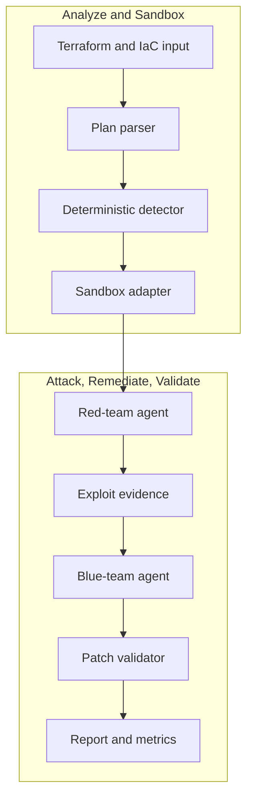

# nullstate

Local-first purple-teaming CLI for infrastructure-as-code sandboxes.


`nullstate` turns Terraform security review into a repeatable attack, patch, and validation loop. It combines a deterministic IaC security core with model-assisted red-team and blue-team reasoning from OpenAI-compatible endpoints such as vLLM on AMD MI300X.

The V1 demo proves public cloud-storage exposure in local sandboxes, applies Terraform remediation, reruns validation, and writes evidence artifacts that can be reviewed by security, cloud, and DevSecOps teams.

## What it does

1. Read Terraform/IaC input.
2. Detect supported exploitable misconfigurations.
3. Infer the scenario and route it to a sandbox backend.
4. Ask a red-team model to reason about the attack path.
5. Execute a constrained generated attack script against the local target.
6. Ask a blue-team model to explain remediation.
7. Apply a deterministic Terraform patch.
8. Validate the attack path is blocked.
9. Write case-study-ready evidence and metrics.

Hackathon V1 includes live LocalStack runs for AWS S3 and Azure Blob scenarios, plus offline deterministic demos for Kubernetes, Docker Compose, on-prem baselines, and generic plan review.

## Why this exists

Static IaC scanners can identify risky configuration, but they do not always prove whether an attacker can use it or whether a remediation blocks the path. `nullstate` turns IaC security review into a repeatable purple-team loop with local-first sandboxes and sanitized evidence artifacts.

## Demo result

Final AMD MI300X/vLLM demo runs used `nullstate-gemma4-26b-a4b` for both red and blue roles:

| Scenario | Target | Finding | Result |
|---|---|---|---|
| `aws-public-s3` | LocalStack AWS | S3 public access block disabled | `Red before: success`, `Red after: blocked` |
| `azure-public-blob` | LocalStack Azure | Anonymous Blob container access | `Red before: success`, `Red after: blocked` |

Representative model metrics:

| Run | Role | Completion tokens | Latency | Output speed |
|---|---|---:|---:|---:|
| AWS S3 | Red | 942 | 9.018s | 104.452 tok/s |
| AWS S3 | Blue | 640 | 3.977s | 160.937 tok/s |
| Azure Blob | Red | 709 | 4.112s | 172.424 tok/s |
| Azure Blob | Blue | 794 | 4.548s | 174.586 tok/s |

## Architecture



See [Architecture](docs/architecture.md) and [Technical Walkthrough](docs/technical-walkthrough.md).

## Security model

V1 does not target real cloud environments by default. Sandboxes are explicit, run artifacts are local, and remediation happens in a copied run workspace rather than mutating the original Terraform directory. The red tool runner is constrained to generated `attack.py` scripts inside the run directory and records command, stdout, stderr, return code, target URL, and timestamps in `events.jsonl`. See [Security Model](docs/security-model.md) and [Threat Model](docs/threat-model.md).

## Installation

Current source install:

```powershell
git clone https://github.com/Ker102/nullstate-cli.git
cd nullstate-cli
python -m pip install -e .
```

This installs the package dependencies and the `nullstate` console command declared in `pyproject.toml`.

If `nullstate` is not recognized after install, your Python Scripts directory is not on `PATH`. You can still run the same CLI through Python:

```powershell
python -m nullstate doctor --offline
```

To see where Python installed console scripts:

```powershell
python -c "import sysconfig; print(sysconfig.get_path('scripts'))"
```

After the first prerelease tag exists, install directly from GitHub:

```powershell
python -m pip install "git+https://github.com/Ker102/nullstate-cli.git@v0.1.0-alpha.1"
```

## Quickstart

```powershell
nullstate
nullstate doctor --offline
nullstate status
nullstate init-demo azure-public-blob --output examples/azure-public-blob
nullstate run examples/azure-public-blob --offline
nullstate report
nullstate scrub
```

Run another offline scenario:

```powershell
nullstate run examples/aws-public-s3 --offline
nullstate run examples/k8s-privileged-pod --offline
nullstate run examples/aws-public-s3 --offline --mock-agents --ci --fail-on-severity high
nullstate baseline --output nullstate-baseline.json
nullstate run examples/aws-public-s3 --offline --mock-agents --ci --baseline-file nullstate-baseline.json
nullstate policy-result --baseline-file nullstate-baseline.json
```

Sandbox discovery:

```powershell
nullstate sandbox list
nullstate sandbox status localstack-azure
nullstate sandbox up localstack-azure --dry-run
nullstate scenarios list
nullstate policy init --output nullstate-policy.json
nullstate policy init --scenario aws-public-s3 --output aws-policy.json
```

`status`, `init-demo`, `sandbox`, and `run` print a short `Next` table with the most likely follow-up commands. `run` defaults to `--scenario auto` and `--target auto`; the CLI infers the scenario from the IaC shape and picks the matching sandbox backend. Pass `--scenario` or `--target` only when recording a specific demo path or testing an adapter.

Runtime attack probes stay local by default. Future non-local HTTP(S) probe targets require `--allow-live-cloud`, and the approval is recorded in `events.jsonl`; current built-in scenarios still resolve to local/offline sandbox targets.

Open the latest report:

```powershell
nullstate report
```

If you keep runs under a named folder, point report lookup at the parent:

```powershell
nullstate report --runs-dir runs/live-aws-model
nullstate report 20260509-200601 --runs-dir runs
```

Create a portable run bundle or a free local HTML dashboard:

```powershell
nullstate bundle
nullstate dashboard --open
nullstate sarif
nullstate upload --dry-run
```

## Live LocalStack demo path

Use this after Docker, Terraform, LocalStack access, and model endpoint variables are configured.

AWS:

```powershell
nullstate sandbox up localstack-aws
nullstate sandbox status localstack-aws
nullstate run examples/aws-public-s3 --target localstack-aws
nullstate report
```

Azure:

```powershell
nullstate sandbox up localstack-azure
nullstate sandbox status localstack-azure
nullstate run examples/azure-public-blob --target localstack-azure
nullstate report
```

The demo Terraform provider includes:

```hcl
metadata_host = "localhost.localstack.cloud:4566"
```

That keeps Terraform pointed at the LocalStack Azure emulator instead of real Azure.

Keep `LOCALSTACK_AUTH_TOKEN` in the shell, `.env.local`, or `.env`. `nullstate sandbox up` auto-discovers `.env.local` first and `.env` second, and `--env-file` remains available for a custom path.

If Docker reports that `127.0.0.1:4566` is already allocated, a leftover LocalStack container is probably reserving the shared edge port. Run:

```powershell
nullstate sandbox down localstack-aws
nullstate sandbox down localstack-azure
docker ps -a --filter name=localstack
```

Docker Compose alternative:

```powershell
$env:LOCALSTACK_AUTH_TOKEN = "<token>"
docker compose -f docker-compose.localstack-azure.yml up
```

Or create a local `.env` file next to the compose file:

```env
LOCALSTACK_AUTH_TOKEN=your-token-here
```

`.env` and `.env.local` are ignored by Git. Do not commit the token.

## Model endpoint

`nullstate` talks to OpenAI-compatible model servers. For self-hosted vLLM, SGLang, or a private proxy, use the custom provider and one endpoint serving both roles:

```powershell
$env:NULLSTATE_LLM_PROVIDER = "custom"
$env:NULLSTATE_LLM_BASE_URL = "http://<mi300x-host>:8000"
$env:NULLSTATE_LLM_API_KEY = "<optional-token>"
nullstate run examples/azure-public-blob --blue-model gemma-4-31b-it --red-model qwen3-coder-next
```

For Google AI Studio / Gemini, users only need the provider preset and API key; `nullstate` supplies the OpenAI-compatible Gemini base URL:

```powershell
$env:NULLSTATE_LLM_PROVIDER = "google"
$env:NULLSTATE_LLM_API_KEY = "<google-ai-studio-key>"
nullstate run examples/azure-public-blob --blue-model gemini-3.5-flash --red-model gemini-3.5-flash
```

For Claude through Anthropic's OpenAI SDK compatibility layer, use the Claude preset. Treat this as an experimental compatibility path; a native Claude adapter is still the better future production path if Claude-specific features are needed:

```powershell
$env:NULLSTATE_LLM_PROVIDER = "claude"
$env:NULLSTATE_LLM_API_KEY = "<anthropic-api-key>"
nullstate run examples/azure-public-blob --blue-model claude-sonnet-4-6 --red-model claude-sonnet-4-6
```

For two vLLM/SGLang containers or two SSH tunnels, set role-specific endpoints:

```powershell
$env:NULLSTATE_LLM_PROVIDER = "custom"
$env:NULLSTATE_RED_LLM_BASE_URL = "http://127.0.0.1:8001"
$env:NULLSTATE_BLUE_LLM_BASE_URL = "http://127.0.0.1:8002"
$env:NULLSTATE_RED_LLM_API_KEY = "<optional-red-token>"
$env:NULLSTATE_BLUE_LLM_API_KEY = "<optional-blue-token>"
nullstate run examples/azure-public-blob --red-model nullstate-red --blue-model nullstate-blue
```

The CLI also accepts `--llm-provider`, `--red-provider`, `--blue-provider`, `--red-base-url`, and `--blue-base-url` for one-off runs. Presets currently include `google`, `claude`, `custom`, and `openai-compatible`. Role-specific settings fall back to `NULLSTATE_LLM_PROVIDER`, `NULLSTATE_LLM_BASE_URL`, and `NULLSTATE_LLM_API_KEY` when they are not set. Explicit base URLs always win, so custom gateways, self-hosted models, and provider proxies stay supported.

Users do not need to write prompts. `nullstate` sends internal red-team and blue-team agent instructions plus scenario evidence. If an endpoint is missing for a role, that role falls back to a deterministic mock response, so local and LocalStack demos can still run without a model. Use `--offline` to skip Terraform/cloud runtime calls and use static IaC parsing. If a shared or role-specific model endpoint is configured, `--offline` still uses that model endpoint; add `--mock-agents` only when you want deterministic no-model agent responses.

## Sandbox backends

| Backend | Mode | IaC target | Status |
|---|---|---|---|
| `localstack-azure` | executable | Terraform AzureRM | live demo target |
| `localstack-aws` | executable | Terraform AWS | live demo target |
| `kind-kubernetes` | executable | Kubernetes YAML, Helm, Kustomize | adapter scaffolded |
| `docker-compose` | digital twin | Docker Compose and app stacks | adapter scaffolded |
| `microvm-onprem` | digital twin | Ansible, Linux hardening, libvirt/Proxmox-style Terraform | design-ready fallback |
| `plan-only` | plan-only | any exported plan/parser | available |

## Scenarios

| Scenario | Backend | Status |
|---|---|---|
| `azure-public-blob` | `localstack-azure` | live LocalStack demo available |
| `aws-public-s3` | `localstack-aws` | live LocalStack demo available |
| `k8s-privileged-pod` | `kind-kubernetes` | offline demo available; live kind pending |
| `compose-exposed-admin` | `docker-compose` | offline demo available; live Docker probe pending |
| `onprem-ssh-password` | `microvm-onprem` | offline demo available; microVM digital twin pending |
| `generic-plan-review` | `plan-only` | available |

## Artifacts

Each run writes:

- `runs/<run-id>/events.jsonl`
- `runs/<run-id>/findings.json`
- `runs/<run-id>/metrics.json`
- `runs/<run-id>/ci-summary.json` when `nullstate run --ci` is used
- `runs/<run-id>/policy-result.json` when `nullstate policy-result` is used
- `runs/<run-id>/vllm-metrics-before.prom` when `/metrics` is reachable
- `runs/<run-id>/vllm-metrics-after.prom` when `/metrics` is reachable
- `runs/<run-id>/vllm-metrics-red-before.prom` and role-specific variants when red/blue endpoints differ
- `runs/<run-id>/attack.py`
- `runs/<run-id>/attack-manifest.json`
- `runs/<run-id>/run-bundle.json` when `nullstate bundle` or `nullstate dashboard` is run
- `runs/<run-id>/dashboard.html` when `nullstate dashboard` is run
- `runs/<run-id>/nullstate.sarif` when `nullstate sarif` is run
- `runs/<run-id>/evidence-manifest.json` when `nullstate evidence-manifest` is run
- `runs/<run-id>/evidence-verification.json` when `nullstate evidence-verify` is run
- `runs/<run-id>/upload-plan.json` when `nullstate upload --dry-run` is run
- `runs/<run-id>/remediation.patch`
- `runs/<run-id>/report.md`
- `scrubbed-runs/<run-id>/scrub-report.json` when `nullstate scrub` is used

Create a scrubbed copy before sharing evidence:

```powershell
nullstate scrub
nullstate scrub 20260608-224625 --runs-dir runs --output-dir scrubbed-runs
```

`events.jsonl` includes `red-tool` entries for the allowlisted attack command before and after remediation.

Export findings for CI or code-scanning upload:

```powershell
nullstate run examples/aws-public-s3 --offline --mock-agents --ci --fail-on-severity none
nullstate sarif
nullstate sarif 20260608-224625 --runs-dir runs --output artifacts/nullstate.sarif
```

Use `--fail-on-severity high` or `--fail-on-severity critical` when the CI job should fail on matching findings.

Create and use a red-tool policy file:

```powershell
nullstate policy init --output nullstate-policy.json
nullstate policy init --scenario aws-public-s3 --output aws-policy.json
nullstate policy validate nullstate-policy.json --output policy-validation.json
nullstate run examples/aws-public-s3 --offline --mock-agents --policy-file nullstate-policy.json
```

The policy file allowlists scenario names, backend names, stages, generated `attack.py` flags, target classifications such as `offline`, `local`, and `local-http`, command policy IDs such as `generated-attack-script-v1`, and ceilings for timeout/output capture. `policy init --scenario` creates a narrower preset for one known scenario/backend pair while keeping the same runner constraints. `nullstate policy validate` checks the policy without running a scenario and exits with code `2` when the file is malformed or invalid.

Create an evidence integrity manifest before attaching a run to a ticket, case study, or support workflow:

```powershell
nullstate evidence-manifest
nullstate evidence-verify
nullstate evidence-manifest 20260608-224625 --runs-dir runs --output artifacts/evidence-manifest.json
nullstate evidence-verify 20260608-224625 --runs-dir runs --manifest artifacts/evidence-manifest.json
$env:NULLSTATE_EVIDENCE_SIGNING_KEY = "<secret>"
nullstate evidence-manifest --signing-key-env NULLSTATE_EVIDENCE_SIGNING_KEY
nullstate evidence-verify --signing-key-env NULLSTATE_EVIDENCE_SIGNING_KEY
```

The manifest inventories shareable run artifacts with SHA-256 hashes, excludes copied workspaces and Terraform internals, and can optionally add a shared-key HMAC-SHA256 evidence signature. `nullstate evidence-verify` recomputes hashes, checks signed manifests when `--signing-key-env` is supplied, and writes `evidence-verification.json`; it exits with code `2` when a recorded artifact is missing, changed, copied from another run, or has an invalid signature. Signing keys are read from environment variables and are never written to the manifest.

Create a baseline from a known run so CI can ignore known findings and fail on new ones:

```powershell
nullstate baseline --output nullstate-baseline.json
nullstate run examples/aws-public-s3 --offline --mock-agents --ci --baseline-file nullstate-baseline.json
nullstate policy-result --baseline-file nullstate-baseline.json
```

`policy-result.json` evaluates an existing run without re-running the scan. It is useful for downstream automation that wants the same threshold and baseline decision as CI in a standalone JSON artifact.

Prepare a future cloud-ingestion upload plan without sending data:

```powershell
nullstate upload --dry-run
nullstate upload 20260608-224625 --runs-dir runs --endpoint https://api.nullstate.dev/v1/runs --dry-run
```

`upload-plan.json` records the target endpoint, bundle checksum, artifact count, token presence, and scrub preflight status. It never stores token values. Raw runs are allowed in dry-run mode but marked `upload_recommended: false`; run `nullstate scrub` first and upload from `scrubbed-runs/` before sharing or future cloud ingestion.

## Documentation

- [Case study](docs/case-study.md)
- [Technical walkthrough](docs/technical-walkthrough.md)
- [Architecture](docs/architecture.md)
- [Security model](docs/security-model.md)
- [Threat model](docs/threat-model.md)
- [CI/CD](docs/ci-cd.md)
- [Runbook](docs/runbook.md)
- [Model serving runbook](docs/model-serving.md)
- [Enterprise roadmap](docs/enterprise-roadmap.md)
- [Enterprise readiness](docs/enterprise-readiness.md)
- [Productization progress](docs/progress.md)
- [Real sandbox red-team command plan](docs/plans/2026-06-01-real-sandbox-red-team-commands.md)
- [Project handoff](docs/handoff.md)
- [AMD compute strategy](docs/compute-strategy.md)
- [Failure modes](docs/failure-modes.md)
- [Cost report](docs/cost-report.md)

## Release model

The `Media` prerelease is only used to host README assets. Product releases should use version tags:

| Tag | Purpose |
|---|---|
| `v0.1.0-alpha.1` | First hackathon prerelease with offline demos and polished docs |
| `v0.1.0-beta.1` | Live LocalStack Azure validation path working |
| `v0.1.0` | Final hackathon release candidate with demo video, case study, and metrics evidence |

The GitHub release title can match the tag or use a readable title such as `nullstate v0.1.0-alpha.1`.

Tagged releases build wheel/sdist artifacts, upload `release-manifest.json` with SHA-256 digests, generate `sbom.spdx.json` from the built wheel installed into a clean environment, and create GitHub artifact attestations for package provenance and the SBOM. Verify a downloaded wheel with:

```powershell
gh attestation verify dist/nullstate-*.whl -R Ker102/nullstate-cli
gh attestation verify dist/nullstate-*.whl -R Ker102/nullstate-cli --predicate-type https://spdx.dev/Document/v2.3
```

## Status

Working now: live LocalStack AWS/Azure storage scenarios, offline deterministic demos for all listed scenarios, constrained red attack command execution, deterministic remediation, sandbox registry, report artifacts, model metrics artifacts, branded CLI output, and DevSecOps repo structure.

Experimental: richer scenario-specific attack scripts, live Kubernetes/Compose/on-prem adapters, richer resolved-dependency SBOMs, and broader artifact redaction coverage.
