# nullstate Architecture

## Goal

Ship a repeatable hackathon demo that shows autonomous purple-teaming of infrastructure-as-code without depending on real cloud credentials.

## Pipeline

```mermaid
flowchart LR
    A[Terraform / IaC directory] --> B[Plan JSON or static parser]
    B --> C[Deterministic exposure detector]
    C --> S[Sandbox adapter]
    S --> D[Red-team agent instructions]
    D --> E[Exploit evidence]
    E --> F[Blue-team agent instructions]
    F --> G[Deterministic remediation]
    G --> H[Validation attack]
    H --> I[Run report and metrics]
```



## Design Choices

- The deterministic detector is the source of truth for demo reliability.
- The red/blue agents receive internal role instructions and scenario evidence; users do not need to prompt the model manually.
- `run` defaults to `--scenario auto` and `--target auto`; explicit values remain available for demos and tests.
- Offline mode uses a static Terraform parser so demos still work without LocalStack, Terraform, or GPUs.
- Online mode follows Terraform automation commands: `init`, `plan -out=tfplan`, and `show -json tfplan`.
- Sandbox backends are explicit adapters: executable, digital twin, or plan-only.

## Sandbox adapters

| Backend | Mode | Target |
|---|---|---|
| `localstack-azure` | executable | Terraform AzureRM |
| `localstack-aws` | executable | Terraform AWS |
| `kind-kubernetes` | executable | Kubernetes YAML, Helm, Kustomize |
| `docker-compose` | digital twin | Docker Compose and app stacks |
| `microvm-onprem` | digital twin | on-prem Linux/VM/network-style IaC |
| `plan-only` | plan-only | any IaC with parser/exported plan |

## On-prem sandboxing model

On-prem infrastructure usually cannot be emulated by one universal cloud emulator. nullstate chooses the best available execution level:

- executable sandbox when a disposable runtime exists
- digital twin sandbox when the topology can be mapped to local containers or VMs
- plan-only analysis when execution would be unsafe or unsupported

## Current Rule

`AZURE_STORAGE_PUBLIC_BLOB` flags `azurerm_storage_container` resources where `container_access_type` is `blob` or `container`.

The remediation sets:

```hcl
container_access_type = "private"
allow_nested_items_to_be_public = false
```

## Scenario roadmap

| Scenario | Target | Sandbox | Execution status |
|---|---|---|---|
| `azure-public-blob` | Terraform AzureRM | LocalStack Azure | offline demo available; live execution pending |
| `aws-public-s3` | Terraform AWS | LocalStack AWS | offline demo available; live execution pending |
| `k8s-privileged-pod` | Kubernetes YAML/Helm/Kustomize | kind | offline demo available; live execution pending |
| `compose-exposed-admin` | Docker Compose | isolated Docker network | offline demo available; live probe pending |
| `onprem-ssh-password` | Ansible/cloud-init/libvirt/Proxmox-style IaC | VM/container-lab digital twin | offline demo available; microVM digital twin pending |
| `generic-plan-review` | unsupported IaC exports | none | plan-only available |
