# nullstate Case Study

## 1. Executive summary

I built `nullstate` to prove that infrastructure security validation can move beyond static scanning into a repeatable red-team/blue-team loop. The platform reads Terraform Azure infrastructure, detects an exploitable Azure Blob exposure, simulates an attacker, applies a blue-team remediation, reruns the attack, and writes an evidence report. The prototype uses Python, Terraform plan JSON, LocalStack-style sandbox adapters, OpenAI-compatible model endpoints, and deterministic fallback logic. The main engineering decision was to keep the security verdict deterministic while using models for adversarial reasoning, explanation, and remediation context. The result is a hackathon-ready CLI with reproducible artifacts and a path toward private MI300X-hosted model analysis.

## 2. Problem

Cloud and platform teams can ship IaC faster than security teams can manually validate it. Static scanners identify possible risk, but they often do not prove whether a misconfiguration is exploitable or whether a fix actually blocks the path. The operator needs a local-first workflow that can run without production credentials, preserve evidence, and produce a case-study-quality report.

## 3. Context and constraints

- 48-hour hackathon timeline.
- Local or AMD Developer Cloud model serving.
- No production cloud targets by default.
- LocalStack Azure requires Docker and `LOCALSTACK_AUTH_TOKEN`.
- The demo must still work if Docker, Terraform, or the model endpoint is unavailable.
- AMD Developer Cloud / DigitalOcean GPU access may be delayed, so Fireworks-compatible managed inference is kept as a contingency.

## 4. Requirements

### Functional requirements

- Analyze Terraform Azure IaC.
- Detect public Azure Blob container exposure.
- Simulate red-team attack before remediation.
- Generate Terraform remediation.
- Validate attack is blocked after remediation.
- Write report, findings, events, patch, and metrics artifacts.
- Provide pluggable sandbox backends for cloud, Kubernetes, Docker, on-prem digital twins, and plan-only mode.

### Non-functional requirements

- No real cloud execution by default.
- No secrets in repo.
- Reproducible offline demo.
- Clear CI/CD and contribution workflow.
- Evidence suitable for recruiters, engineers, and hackathon judges.

## 5. Architecture

See [Architecture](architecture.md).

```mermaid
flowchart LR
    IaC[Terraform / IaC input] --> Parser[Plan parser]
    Parser --> Detector[Deterministic detector]
    Detector --> Sandbox[Sandbox adapter]
    Sandbox --> Red[Red-team agent]
    Red --> Evidence[Exploit evidence]
    Evidence --> Blue[Blue-team agent]
    Blue --> Patch[Terraform patch]
    Patch --> Validate[Validation attack]
    Validate --> Report[Report and metrics]
```



## 6. Security model

See [Security Model](security-model.md) and [Threat Model](threat-model.md).

| Risk | Control | Evidence |
|---|---|---|
| Accidental real-cloud attack | LocalStack/plan-only defaults | CLI target model |
| Secret leakage | `.env.example`, `.gitignore`, SECURITY.md | repo files |
| Unsafe agent execution | allowlisted sandbox backends | sandbox registry |
| Unreviewed main changes | PR template and CI checks | `.github/` |

## 7. Deployment pipeline

See [CI/CD](ci-cd.md).

```text
branch -> PR -> tests/lint/type/audit -> review -> squash merge -> tag -> release
```

## 8. Operations

See [Runbook](runbook.md).

Operational evidence includes CLI run artifacts, model endpoint type, vLLM Prometheus snapshots when available, and local `amd-smi` or `rocm-smi` output when GPU tools are present.

## 9. Cost analysis

See [Cost Report](cost-report.md). V1 is designed to run locally, with AMD Developer Cloud used only for model-serving evidence.

See [AMD Compute Strategy](compute-strategy.md) for the primary DigitalOcean/AMD path and Fireworks fallback.

## 10. Results

- Offline CLI demo runs end to end.
- Unit test suite covers findings, remediation, reports, metrics, and sandbox registry.
- Run artifacts include report, findings, events, attack script, patch, workspace copy, and metrics.
- Offline deterministic scenario demos cover AWS, Kubernetes, Docker Compose, on-prem digital twins, and generic plan-only review.

## 11. Tradeoffs

| Decision | Alternative | Why chosen | Downside |
|---|---|---|---|
| CLI first | Web app first | faster, stronger technical demo | less visual polish |
| Deterministic detector | pure LLM scanner | reliable verdict | narrower first rule set |
| LocalStack Azure v1 | real Azure | safer and repeatable | emulator feature gaps |
| Adapter registry | one sandbox hardcoded | future multi-IaC support | some adapters are scaffolds |

## 12. Failure modes and lessons learned

See [Failure Modes](failure-modes.md).

## 13. What I would improve next

- Add real LocalStack Azure exploit execution.
- Add AWS, Kubernetes, and Docker Compose scenario detectors.
- Add streamed time-to-first-token metrics.
- Add AMD GPU-hosted model evidence with vLLM `/metrics` and `amd-smi` or `rocm-smi` snapshots.
- Add SBOM and signed release provenance.

## 14. Repository and demo links

- GitHub repo: pending publish.
- Demo: `python -m nullstate run examples/azure-public-blob --offline`

## 15. Interview explanation

I built `nullstate` because static IaC scanning alone does not prove exploitability or remediation effectiveness. The architecture uses deterministic plan analysis, sandbox adapters, and red/blue model roles to create a local purple-team loop. The most important security decision was to avoid production cloud execution by default. The hardest tradeoff was keeping the hackathon scope narrow while making the adapter model credible for future IaC targets.

## 16. Resume bullets

- Built a Python DevSecOps CLI that validates Terraform Azure misconfigurations through a local red-team/blue-team loop.
- Implemented deterministic IaC detection, Terraform remediation, sandbox backend abstractions, and evidence artifacts.
- Designed a secure GitHub workflow with tests, dependency audit, CodeQL, dependency review, and structured PR templates.
