# nullstate: Autonomous Purple-Team IaC Sandbox on AMD MI300X

## 1. Executive summary

I built `nullstate` during the AMD x lablab.ai hackathon to test whether infrastructure security validation could move beyond static IaC findings into a repeatable red-team/blue-team loop. The CLI reads Terraform projects, starts a local sandbox target, detects dangerous cloud storage exposure, asks a red-team model to reason about the attack path, asks a blue-team model to explain remediation, applies a deterministic Terraform patch, reruns validation, and writes judge-ready evidence artifacts. The final demo used LocalStack sandboxes, Terraform automation commands, a Python Typer/Rich CLI, OpenAI-compatible vLLM endpoints, ROCm, and an AMD Instinct MI300X GPU droplet. The key engineering decision was to make the security verdict deterministic while using the model for adversarial reasoning, explanation, and report quality. The result was a working hackathon prototype with final AWS and Azure runs showing vulnerable infrastructure, exploit evidence, patched Terraform, and blocked attack paths.

## 2. Problem

IaC scanners are useful, but they often stop at "this configuration looks risky." A platform or security engineer still has to answer harder operational questions:

- Is the finding actually exploitable in this context?
- What evidence proves the exposure?
- What exact Terraform change remediates it?
- Did the attack path fail after the patch?
- Can this be demonstrated without touching production cloud accounts?

`nullstate` targets that gap. The user should be able to point the CLI at an IaC project and get a reproducible evidence trail: finding, attack reasoning, remediation, validation, and a report that a security, cloud, or DevSecOps reviewer can inspect.

## 3. Context and constraints

- Hackathon build window: roughly 48 hours.
- Final submission pressure: working evidence needed before the deadline, not a broad but unfinished platform.
- Cloud target: local sandboxes first, no real Azure or AWS credentials by default.
- Model target: self-hosted endpoint on AMD MI300X through vLLM/ROCm.
- Runtime target: LocalStack for AWS and Azure-style scenarios.
- UX target: CLI-first instead of a full web application.
- Security constraint: do not expose vLLM, LocalStack, cloud tokens, Terraform state, or `.env` values publicly.
- Reliability constraint: model output must not be the source of truth for the pass/fail verdict.

## 4. Requirements

### Functional requirements

- Analyze Terraform IaC.
- Infer or accept a scenario target.
- Start and inspect local sandbox backends.
- Detect high-risk public cloud storage exposure.
- Generate red-team attack reasoning with a self-hosted model endpoint.
- Generate blue-team remediation explanation with a self-hosted model endpoint.
- Apply deterministic Terraform remediation.
- Re-run validation after remediation.
- Produce `report.md`, `findings.json`, `events.jsonl`, `metrics.json`, `attack.py`, and `remediation.patch`.
- Support offline/mock mode so the demo can still run without GPU or sandbox access.

### Non-functional requirements

- No real cloud execution by default.
- No arbitrary red-agent shell execution in V1.
- Commands should be understandable under hackathon demo pressure.
- Run artifacts should be suitable for later case-study evidence.
- Secrets and provider state must be kept out of Git.
- CI/CD should use PR checks, dependency review, CodeQL, and branch protection.

## 5. Architecture

```mermaid
flowchart LR
    A[Terraform IaC input] --> B[Terraform init / plan / show JSON]
    B --> C[Deterministic detector]
    C --> D[Sandbox adapter]
    D --> E[Red-team model reasoning]
    E --> F[Attack evidence]
    F --> G[Blue-team model remediation]
    G --> H[Deterministic Terraform patch]
    H --> I[Re-plan and apply]
    I --> J[Validation attack]
    J --> K[Report and metrics artifacts]
```



The CLI separates reliable security decisions from model-generated explanation:

- Terraform automation runs `terraform init -input=false`, `terraform plan -out=tfplan -input=false`, `terraform show -json tfplan`, and `terraform apply -auto-approve -input=false tfplan` for live runs.
- The deterministic detector identifies supported exposures from Terraform configuration and plan JSON.
- The red-team model receives the finding evidence and writes attack reasoning.
- The blue-team model receives the finding evidence and writes remediation guidance.
- The deterministic remediation engine applies the Terraform patch.
- The validator checks whether findings remain and records the post-remediation attack result.

## 6. What the red agent actually does today

This is important to describe accurately.

In the current V1 prototype, the red agent does not execute arbitrary commands against the sandbox. The red agent is an LLM call through an OpenAI-compatible endpoint. It receives an internal system prompt and scenario findings, then returns attack reasoning such as anonymous S3 reads or Azure Blob `curl` requests.

The commands that actually run are Terraform automation commands, and they are recorded in `events.jsonl`. The attack outcome is currently produced by the deterministic scenario function, not by giving the model a shell. `attack.py` is generated as a controlled run artifact, but today it is a scenario placeholder rather than a fully executed exploit runner.

That design was intentional for the hackathon: it keeps the demo reliable and avoids unsafe agent tool execution. The next version should add an allowlisted red-tool runner that can execute only approved commands against local sandbox endpoints and log every command, stdout, stderr, return code, and target URL.

## 7. Security model

| Risk | Control | Evidence |
|---|---|---|
| Accidental real cloud attack | LocalStack and plan-only targets by default | sandbox adapters and run commands |
| Model makes unsafe recommendation | deterministic detector and remediation remain source of truth | `findings.json`, `remediation.patch` |
| Arbitrary exploit execution | red agent has no shell in V1 | `src/nullstate/agents.py`, `src/nullstate/attack.py` |
| Secret leakage | `.env` and Terraform state ignored; screenshots must be redacted | repo hygiene and submission checklist |
| Public model endpoint exposure | vLLM bound through SSH tunnel, not public ingress | droplet setup and tunnel workflow |
| Unreviewed code changes | PR workflow, branch protection, CI checks | GitHub PRs and checks |

## 8. Deployment and DevSecOps workflow

The project was built with a branch and PR workflow instead of direct main edits:

```text
feature branch
-> PR
-> unit tests, lint, type checks, dependency/security checks
-> review/merge
-> release tag / release notes
```

Repository practices added during the build:

- Python package metadata and console entrypoint.
- Structured docs: architecture, runbook, threat model, security model, CI/CD, cost notes, and failure modes.
- GitHub Actions for quality checks.
- CodeQL and dependency review.
- Dependabot-style dependency hygiene.
- Case-study evidence checklist kept out of Git.
- Release-oriented workflow with tagged submission artifacts.

## 9. Final demo results

### AWS public S3 scenario

Run artifact:

```text
runs/final-aws-gemma26b/20260510-170931
```

Finding:

```text
HIGH AWS_S3_PUBLIC_ACCESS_BLOCK_DISABLED
Resource: aws_s3_bucket_public_access_block.public_logs
Evidence: block_public_acls, block_public_policy, ignore_public_acls, and restrict_public_buckets were disabled.
```

Remediation patch:

```diff
-  block_public_acls       = false
-  block_public_policy     = false
-  ignore_public_acls      = false
-  restrict_public_buckets = false
+  block_public_acls       = true
+  block_public_policy     = true
+  ignore_public_acls      = true
+  restrict_public_buckets = true
```

Result:

```text
Red before: success
Red after: blocked
Verdict: Exploit blocked after remediation
```

Model metrics from `metrics.json`:

| Role | Model | Completion tokens | Latency | Output speed |
|---|---:|---:|---:|---:|
| Red | `nullstate-gemma4-26b-a4b` | 942 | 9.018s | 104.452 tok/s |
| Blue | `nullstate-gemma4-26b-a4b` | 640 | 3.977s | 160.937 tok/s |

### Azure public Blob scenario

Run artifact:

```text
runs/final-azure-gemma26b/20260510-174858
```

Finding:

```text
HIGH AZURE_STORAGE_PUBLIC_BLOB
Resource: azurerm_storage_container.secrets
Evidence: container_access_type is "container"; storage account allows nested items to be public.
```

Remediation patch:

```diff
-  allow_nested_items_to_be_public  = true
+  allow_nested_items_to_be_public  = false

-  container_access_type = "container"
+  container_access_type = "private"
```

Result:

```text
Red before: success
Red after: blocked
Verdict: Exploit blocked after remediation
```

Model metrics from `metrics.json`:

| Role | Model | Completion tokens | Latency | Output speed |
|---|---:|---:|---:|---:|
| Red | `nullstate-gemma4-26b-a4b` | 709 | 4.112s | 172.424 tok/s |
| Blue | `nullstate-gemma4-26b-a4b` | 794 | 4.548s | 174.586 tok/s |

## 10. Evidence artifacts

Each run creates:

- `events.jsonl`: timeline of Terraform, analysis, red-team, blue-team, and validation events.
- `findings.json`: structured finding data.
- `attack.py`: generated scenario attack artifact.
- `remediation.patch`: deterministic Terraform diff.
- `metrics.json`: model call token counts, latency, throughput, and endpoint metrics.
- `report.md`: human-readable case-study report.
- `workspace/`: copied Terraform workspace for reproducibility.

Screenshots to add before publishing:

- `nullstate` root command showing logo and next commands.
- `nullstate run` summary for AWS or Azure.
- `report.md` showing `Exploit blocked after remediation`.
- DigitalOcean MI300X droplet GPU page.
- vLLM `/v1/models` response for `nullstate-gemma4-26b-a4b`.
- vLLM `/metrics` or `metrics.json` token throughput evidence.
- GitHub PR/checks/release page.

## 11. Cost analysis

The main cost driver was the AMD MI300X GPU droplet used for model serving. LocalStack and Terraform ran locally, and the CLI did not require paid cloud resources for AWS or Azure infrastructure. The cost-control decision was to keep real cloud execution out of scope and use the GPU only long enough to collect model-serving evidence and final run metrics.

Final portfolio version should include:

- Total DigitalOcean credits used.
- Droplet runtime hours.
- Whether the droplet was destroyed after evidence collection.
- Any failed boot/model attempts that consumed GPU time.

## 12. Tradeoffs

| Decision | Alternative | Why chosen | Downside |
|---|---|---|---|
| CLI-first product | Next.js dashboard | Faster to build, better for terminal evidence | Less visual for non-technical judges |
| Deterministic security core | Pure LLM scanner | Reliable pass/fail and reproducible patching | Narrower scenario coverage in V1 |
| LocalStack sandbox | Real AWS/Azure | Safer and no production credentials | Emulator differences and setup friction |
| One large model for red and blue | Separate red/blue models | Avoided dual-container VRAM/runtime failures | Less role specialization |
| OpenAI-compatible endpoint | Provider-specific SDK | Works with vLLM, SGLang, or managed fallback | Requires endpoint setup knowledge |
| No red shell in V1 | Autonomous tool execution | Safer under hackathon constraints | Attack execution is not fully autonomous yet |

## 13. Failure modes and lessons learned

- DigitalOcean account access blocked early setup, so GPU work started later than planned.
- LocalStack containers can leave port `4566` reserved; the CLI now gives a specific recovery hint.
- Editable Python installs break when the repo path changes; production installs should use the package entrypoint.
- Running two model containers on one MI300X caused VRAM pressure and cache allocation failures.
- ROCm AITER fused-MoE paths failed for one Gemma startup attempt, so the final path used a single larger model endpoint.
- SGLang/Qwen3.5 experimentation was deprioritized after runtime import issues.
- Model metrics from a local Windows run cannot capture `amd-smi` directly unless collected on the droplet; endpoint metrics and droplet screenshots fill that evidence gap.

## 14. What I would improve next

- Add an allowlisted exploit runner so red-agent command execution is real, constrained, and fully logged.
- Add `nullstate run --auto-sandbox` for known local targets.
- Add custom LocalStack port support so AWS and Azure sandboxes can run side by side.
- Add an artifact scrubber before publishing reports.
- Add SBOM, package signing, and release provenance.
- Add more Azure, AWS, Kubernetes, Docker Compose, and on-prem digital-twin scenarios.
- Build a portfolio demo page with embedded screenshots, architecture diagram, and video.

## 15. Repository and demo links

- GitHub: <https://github.com/Ker102/nullstate-cli>
- Suggested portfolio slug: `/case-studies/nullstate-autonomous-purple-team-iac-sandbox`
- Demo video: pending
- Final AWS report: `runs/final-aws-gemma26b/20260510-170931/report.md`
- Final Azure report: `runs/final-azure-gemma26b/20260510-174858/report.md`

## 16. Interview explanation

I built `nullstate` because IaC security tools often identify misconfigurations without proving exploitability or remediation effectiveness. The architecture uses Terraform plan analysis, LocalStack sandboxes, deterministic detection, and self-hosted model agents to create a repeatable purple-team loop. The most important security decision was to keep the pass/fail verdict deterministic and avoid arbitrary red-agent shell execution in V1. The hardest tradeoff was choosing reliability over full autonomy under hackathon time pressure. If I rebuilt it, I would add a constrained exploit runner that logs every red-team command and network request against the local sandbox.

## 17. Resume bullets

- Built `nullstate`, a Python DevSecOps CLI that validates Terraform IaC through a local red-team/blue-team loop with deterministic remediation and evidence artifacts.
- Served a large model on AMD MI300X with vLLM/ROCm and captured token, latency, throughput, and endpoint metrics for final AWS and Azure sandbox runs.
- Implemented Terraform analysis, LocalStack sandbox workflows, structured run artifacts, report generation, CI checks, threat model, runbook, and release-oriented PR workflow.
- Produced final demo evidence showing public S3 and Azure Blob exposures remediated and revalidated as blocked attack paths.
